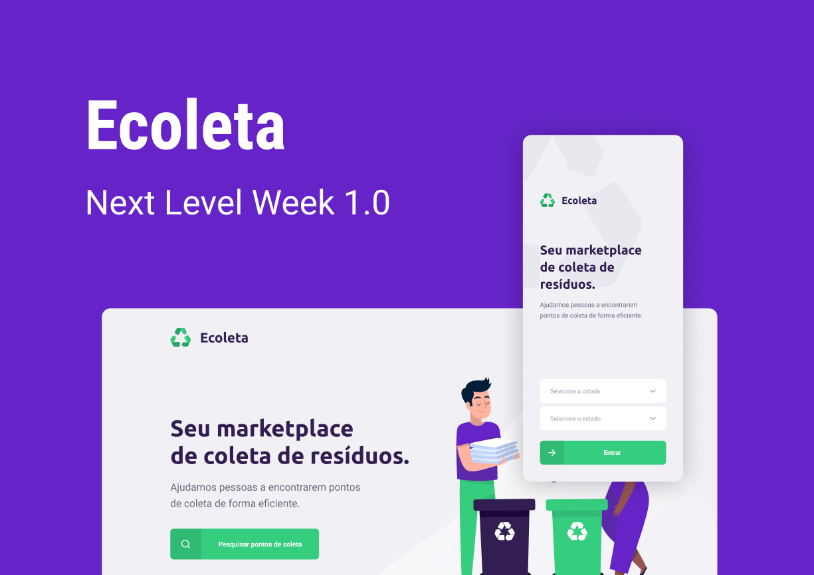

<br />


# NLW - Ecoleta API 


API desenvolvida em Node.js, knex.js e SQLite 3

<div style="text-align:center">
    
    
</div>

## Ecossistema

---

A API será utilizada para o cadastro de pontos de coleta, listagem de pontos de coleta, listagem de items e para fornecer todos os dados necessários para a aplicação Web e Mobile.  



## Configuração de Ambiente

---

Primeiro, instale as dependências:

```bash
npm install
```

Depois, crie e inicialize o banco de dados:

```bash
npm run knex:migrate // para gerar o banco de dados em sqlite3
npm run knex:seeds   // para inserir os dados padrão
```

Pronto! Agora é só inicializar

```bash
npm run dev
```

## Rotas

---

| Recurso          |  Descrição                                     |
| ---------------- | ---------------------------------------------- |
|  GET /items      |  Retorna uma lista de items                    |
|  GET /points     |  Retorna todos os pontos de coleta cadstrados  |
|  GET /points/:id |  Retorna o ponto de coleta do ID               |
|  POST /points    |  Cadastra um novo ponto de coleta              |

## Autor

---

[Christian Murata](https://github.com/christianmurata)